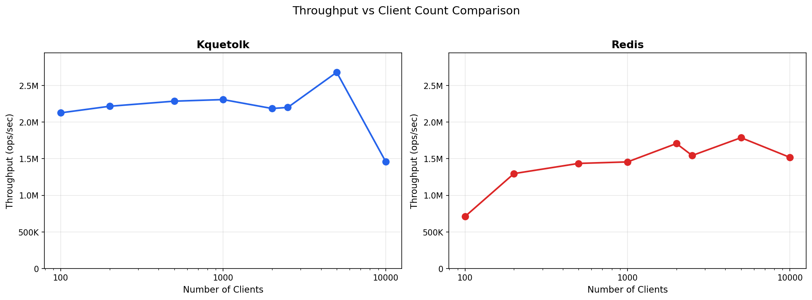
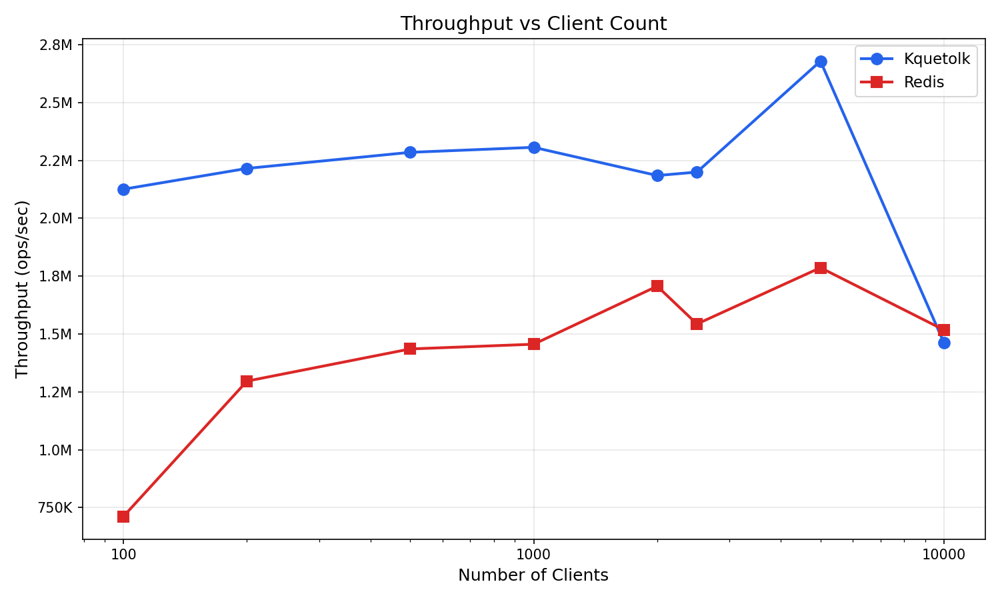
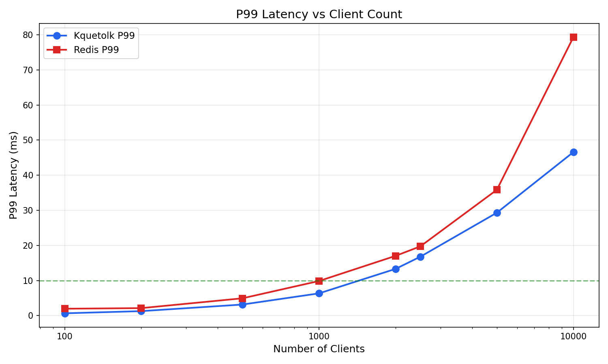
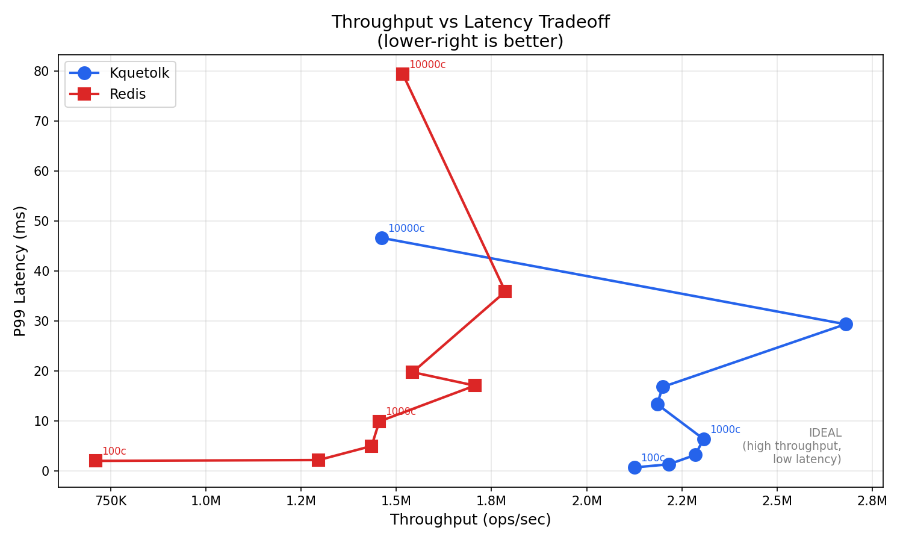
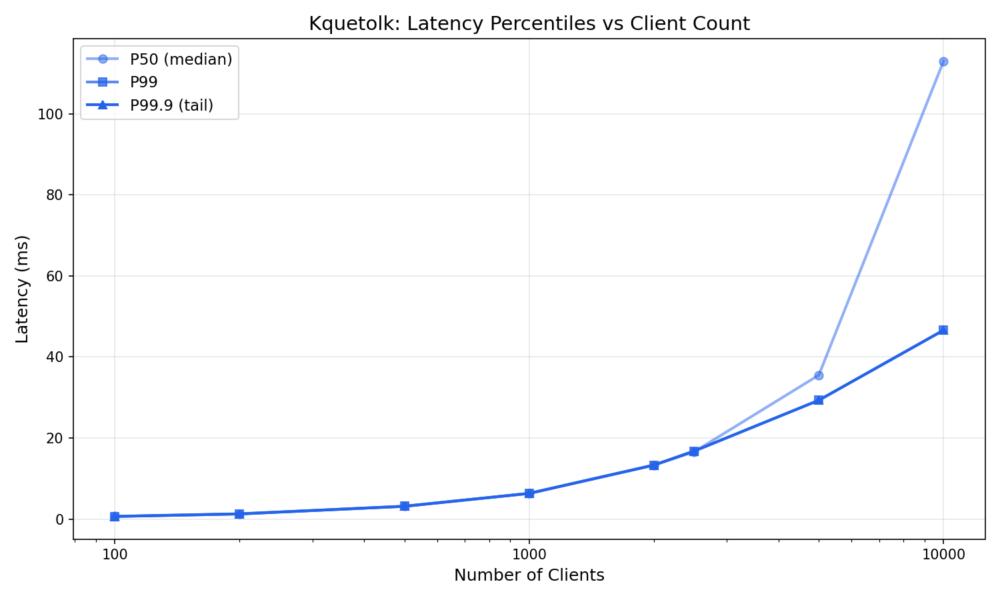
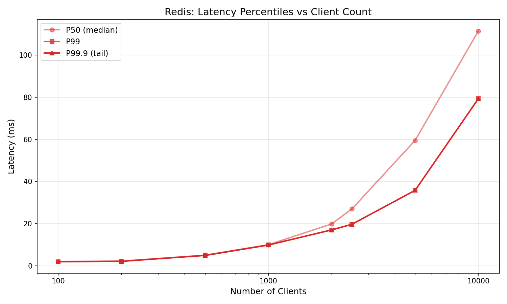
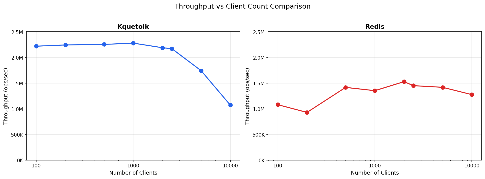
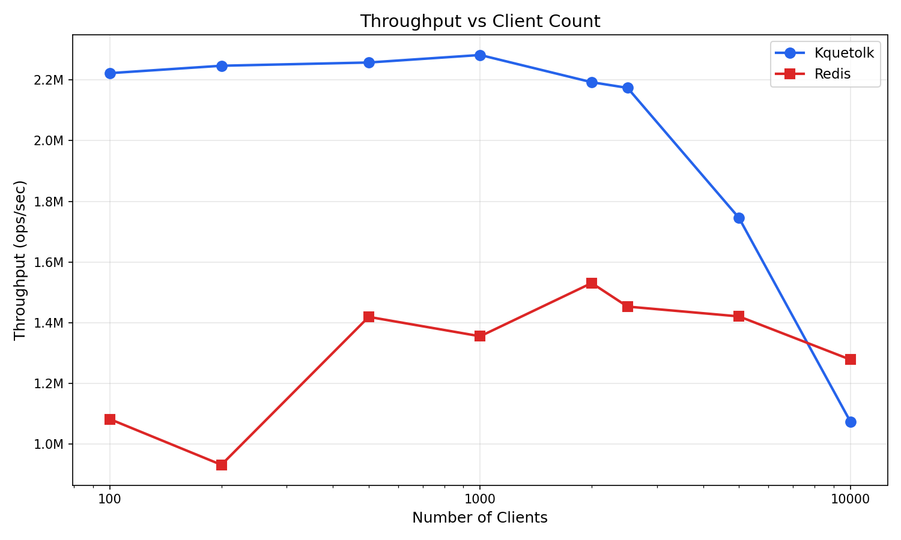

# Kquetolk

A high-performance Redis-compatible in-memory server implementing the RESP protocol in Go.

## Features

- High-performance event-loop networking via [gnet](https://github.com/panjf2000/gnet)
- RESP protocol parser
- Sharded in-memory storage (32 shards, FNV-1a hashing)
- TTL support with lazy + parallel eviction (one worker per shard)
- Commands: `PING`, `ECHO`, `SET`, `GET`, `DEL`, `EXISTS`, `INCR`, `KEYS`

## Usage

```sh
make build && make run
```

## Benchmark

Tested on Apple M4 Pro with `memtier_benchmark` (pipeline=16, 1:10 SET:GET ratio).

### 1,000 Concurrent Connections

```
memtier_benchmark -s 127.0.0.1 -p 6379 -t 4 -c 250 --pipeline=16 -n 100000
```

| Operation | Ops/sec | Avg Latency | p99 Latency |
|-----------|---------|-------------|-------------|
| SET | 226K | 6.47 ms | 8.51 ms |
| GET | 2.26M | 6.47 ms | 8.51 ms |
| **Total** | **2.48M** | **6.47 ms** | **8.51 ms** |

### 10,000 Concurrent Connections

```
memtier_benchmark -s 127.0.0.1 -p 6379 -t 4 -c 2500 --pipeline=16
```

| Operation | Ops/sec | Avg Latency | p99 Latency |
|-----------|---------|-------------|-------------|
| SET | 175K | 118 ms | 860 ms |
| GET | 1.75M | 118 ms | 860 ms |
| **Total** | **1.92M** | **118 ms** | **860 ms** |

### Comparison with Redis

Benchmarked against `redis:latest` Docker image under identical conditions.

#### 1,000 Connections

| Server | Ops/sec | Avg Latency | p99 Latency |
|--------|---------|-------------|-------------|
| **Kquetolk** | **2.48M** | **6.47 ms** | **8.51 ms** |
| Redis | 1.71M | 10.18 ms | 18.43 ms |

#### 10,000 Connections

| Server | Ops/sec | Avg Latency | p99 Latency |
|--------|---------|-------------|-------------|
| **Kquetolk** | **1.92M** | **118 ms** | 860 ms |
| Redis | 1.76M | 107 ms | **545 ms** |

### Analysis

- **1K connections**: Kquetolk is **45% faster** with 36% lower latency
- **10K connections**: Kquetolk is **9% faster** in throughput, though Redis has better tail latency
- gnet's event-loop architecture (epoll/kqueue) efficiently handles high connection counts with minimal overhead


### Benchmark Visualizations (Gnet implementation)













### Benchmark Visualizations (Old net package, per conn per goroutine model)





### Generate Benchmark Graphs

```bash
# Run benchmarks (uses memtier with 3 iterations for reliability)
./benchmark/run_benchmark.sh 6379 benchmark/kquetolk_results.csv

# Optional: benchmark Redis for comparison
docker run -d -p 6380:6379 redis:latest
./benchmark/run_benchmark.sh 6380 benchmark/redis_results.csv

# Generate graphs (requires: pip3 install matplotlib)
python3 benchmark/plot_benchmark.py benchmark/kquetolk_results.csv benchmark/redis_results.csv
```

Generates: throughput comparison, P99 latency, latency percentiles (p50/p99/p99.9), and throughput-latency tradeoff curves.
